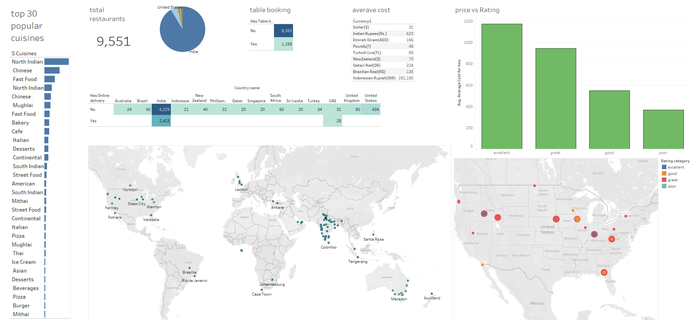

# Analysing_zomato_Dataset
Zomato is an  multinational restaurant aggregator and food delivery company. The idea of analysing the Zomato_dataset is to get the overview of what actutally is happening in their business. Zomato Dataset consist of more than 9000 rows with columns such as Restaurants_id, Restaurants_name, City, Location, Cuisines and many more...

first I explore and cleaned the dataset and then analize it with sql.
at the end I made some visualization with tablaeu. I hope it's helpfull 

